<h1 align="center">Hi 👋, I'm Moshe Rubin</h1>

moshemoshe137

<h3 align="center">A data analyst in Chicago, IL</h3>

- 👨‍🏫 I'm Moshe (rhymes with [_Nova Scotia_](https://en.wikipedia.org/wiki/Nova_Scotia)
  or [_Kenosha_](https://en.wikipedia.org/wiki/Kenosha,_Wisconsin))

- 🔭 I’m currently working on [EAB Tools](https://github.com/moshemoshe137/EAB_tools)

- 🌱 I’m currently learning [Rust](https://rust-book.cs.brown.edu/title-page.html)

- 👨‍💻 All of my projects are available at
  [https://github.com/moshemoshe137](https://github.com/moshemoshe137)

- 💬 Ask me about **[pandas](https://pandas.pydata.org/), [NumPy](https://numpy.org/),
  or [statsmodels](https://www.statsmodels.org/stable/index.html)**

- 📫 How to reach me [**mosherubin137@gmail.com**](mailto:mosherubin137@gmail.com)

- 😄 Pronouns: **He/Him**

> Physicists have agonized over 137 for the past fifty years. Werner Heisenberg once
> proclaimed that all the quandaries of quantum mechanics would shrivel up when 137 was
> finally explained. I tell my undergraduate students that if they are ever in trouble
> in a major city anywhere in the world they should write “137” on a sign and hold it up
> at a busy street corner. Eventually, a physicist will see that they're distressed and
> come to their assistance. (No one to my knowledge has ever tried this, but it should
> work.)
>
> Leon M. Lederman, _The God Particle_ (1993)

### Connect with me:

  
  

### Languages and Tools:

  
  
  
  
  
  
  
  
  

  

